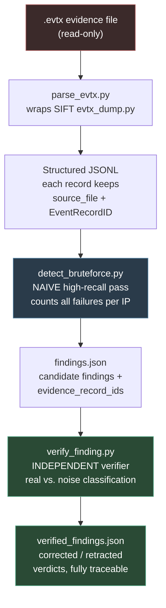

# Architecture

This document describes how the components connect and where trust boundaries are enforced.

## Architectural pattern

**Direct Agent Extension** (SANS FIND EVIL! Approach 1) — Claude Code on the SIFT Workstation acts as the agentic execution engine, driving a pipeline of purpose-built Python tools. The detection intelligence is split across two layers so that self-correction is an architectural property of the system rather than a prompt instruction.

## Component flow

## Trust boundaries

| Boundary | Enforcement | Type |
|----------|-------------|------|
| Evidence is never modified | Tools only read the input `.evtx` and write to a separate `output/` directory; input and output paths are distinct by design | **Architectural** |
| Findings must be traceable | Every finding carries the `EventRecordID`s it was derived from; no claim exists without source records | **Architectural** |
| A finding is not trusted until verified | The detector cannot mark anything "confirmed"; only the independent verifier sets a final verdict | **Architectural** |

Note: these guardrails are **architectural**, not prompt-based — the system's structure prevents evidence modification and untraceable claims regardless of how the agent is prompted.

## Why two layers

A single "smart" detector hides its reasoning in one black box. Splitting detection (high-recall, naive) from verification (precise, auditable) means:

1. The self-correction step is **visible and inspectable** — you can see the before/after verdict.
2. Validation logic lives in **one dedicated place** rather than being entangled with detection.
3. It mirrors real analyst triage: flag broadly, then confirm rigorously.

